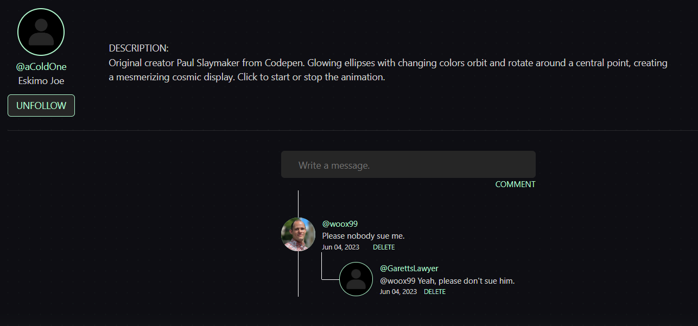

TrixEx is a social platform designed for web developers to exchange front-end components.

## About TrixEx

TrixEx was my first non-tutorial project built. It is a demo full-stack project for demonstrational purposes for my portfolio. You can get the full feel for the site without creating an account [here](http://3.144.111.10/index). 

## Build Stack
              

 

## Features
🔒 User Authentication & Authorization
* Password ***hashing***
* Registration ***validation***
* Route protection

---

To ***create*** a project, paste your HTML, CSS, and JS into the browser and watch your component come to life in real time.
* Set the project to ***private*** and it will only be visible to the creator.
* Set the project to ***public*** for the whole TrixEx community to see. 

---

Viewing someone's component will show the code for it. If you like their work you can view their ***profile page*** and it will display their other public projects. 

***Follow*** users to show your support and keep track of components that interest you with the ***favorite*** button.

* One to many relationship with users and projects
* Many to many relationship with users and ***followers***
* Many to many relationship with users and ***favorites***

---

Drop a ***comment*** or ***reply*** to get involved with other users in the TrixEx community.

* One to many relationship with users and comments
* Many to many relationship with comments and projects

---

***Search*** will return users or project results.

---

***Responsive*** design to fit any device.

---

***Adminstrative*** dashboard for approved users to manage user activity.

* Delete inappropriate content
* Ban rule breakers

